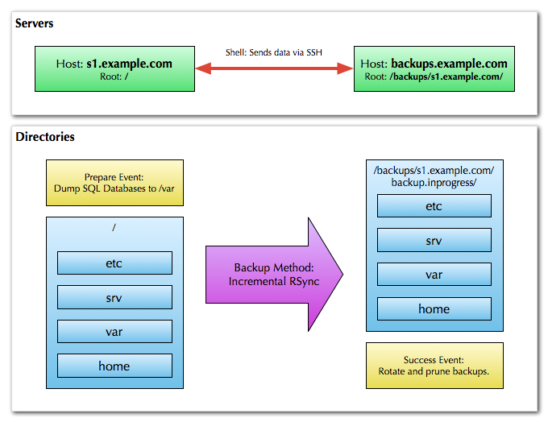
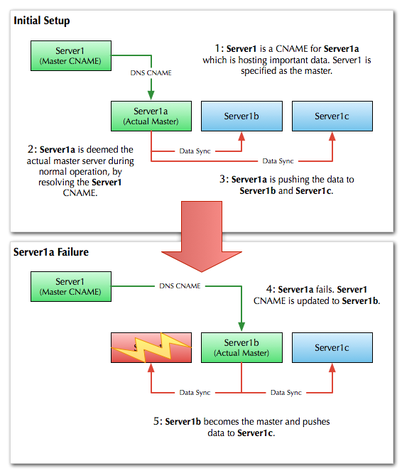

# Getting Started

This guide gives an overview of Synco, how to install it how to use it to backup and replicate data.

## Installation

Synco is a Ruby gem, and can be installed using the following command:

```bash
$ gem install synco
```

## Core Concepts

Data is a valuable and often irreplaceable asset. Because of this, it is important to protect data such that it continues to exist despite failure and loss of equipment. Long term protection of data involves replication. This is because the probability of a catastrophic failure leading to data loss is reduced when said data is replicated across different storage systems. Synco is a high level tool for coordinating data backup and replication, including support for both online (realtime) and offline replication. It is designed to provide scalability and simplicity without compromising either.

Synco has several important concepts which are used to structure the backup script: **servers**, **directories**, the **method**, and the **master**. Each of these objects has associated **event handlers**.

[](script-structure.png)
	
### Servers

A server object represents a specific host system and a specific root directory within that system. A host system can have a host name specified explicitly, or it can simply refer to the localhost (default). A server also has a root directory, in which all related operations will be performed in.

It is possible to have two server objects that refer to the same host, but have different root directories. In this case, you would be copying data from one location on a server to another.

### Directories

A directory object specifies a relative path where data resides on a server. The path is resolved for a particular server by mapping the directory into the given server's root path.
	
### Method

A method specifies the way data is copied between servers and directories. As an example, Synco includes two methods {ruby Synco::Methods::RSync} which provides data synchronisation and {ruby Synco::Methods::RSyncSnapshot} which provides incremental backups.

Typically, methods also have directionality associated with them:

- **Push**: Data is pushed by the master server to the backup server.
- **Pull**: Data is pulled by the backup server from the master server.

Directionality has implications for both security and performance.

In terms of security, the non-controlling server must provide open access to the controlling server, typically via SSH; in the case of a push backup, the backup server itself may be open to attack, and in the case of a pull backup, the master server may be vulnerable.

Depending on the network setup, performance may be improved or degraded by a particular direction. This is because if multiple backup servers are trying to access the same resource at once, the available capacity might be saturated; on the other hand, if there are multiple backup servers with individual (slow) network links, it may be more efficient to run them all at the same time.

### Master

A backup script represents a single backup processes that can be executed from any machine. The actual work done is based on the master specified in the script. The master specifies the primary source of information in any backup or synchronisation task.

The master server can either be explicitly specified by using its symbolic name in the backup script, or resolved by matching a host name to a specific server instance.

In a homogeneous network of synchronized servers, this means that slaves will replicate from a master. If the master is failed, another slave can pick up the slack by promoting it to master.

## Example

The master server is the primary server that contains the original data. It is responsible for sending data to the other servers defined in the script.
	
It's common for network services to have several replicas. Synco backup scripts define all servers, and use DNS to define the "master server" which contains the original data. If a server fails, the DNS record can be updated to point to another server, and the backup script will automatically replicate the data from the new master server.



A Synco implementation for the above diagram would look something like this:

```ruby
Synco.run_script do |script|
	script.method = Synco::Methods::RSync.new(:push)
	
	script.master = "server1.example.com"
	
	script.server(:server1a) do |server|
		server.host = "server1a.example.com"
		server.root = "/"
	end
	
	script.server(:server1b) do |server|
		server.host = "server1b.example.com"
		server.root = "/"
	end
	
	script.server(:server1c) do |server|
		server.host = "server1c.example.com"
		server.root = "/"
	end
	
	script.copy('srv')
end
```

We define the method of synchronization, the master server name (which in this case is a CNAME to the actual master server), and the servers to which the data will be replicated. The `backup` method is used to specify the directories to be replicated.
